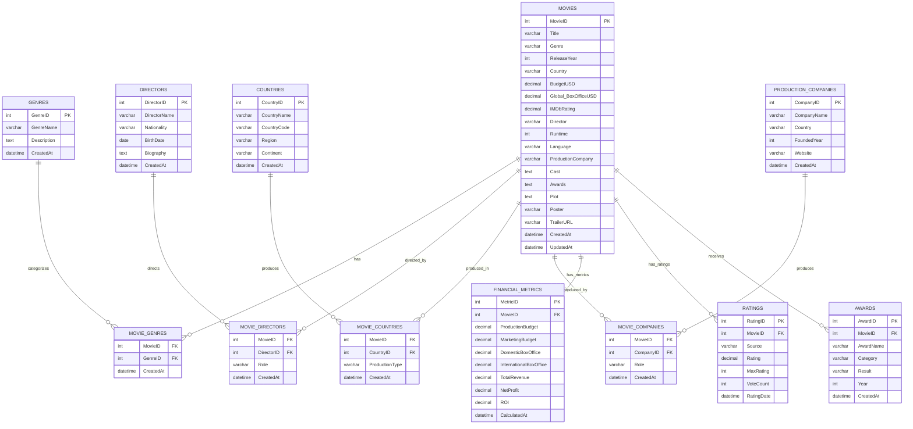

# 🗄️ Base de Datos - Movies Analytics

## 📊 Diagrama Entidad-Relación (ER)



## 📖 Diccionario de Datos

### 🎬 Tabla: MOVIES (Principal)

| Campo | Tipo | Longitud | Nulo | Clave | Descripción |
|-------|------|----------|------|-------|-------------|
| MovieID | INT | - | NO | PK | Identificador único de la película |
| Title | VARCHAR | 255 | NO | - | Título de la película |
| Genre | VARCHAR | 100 | SÍ | - | Género principal (legacy field) |
| ReleaseYear | INT | - | NO | - | Año de lanzamiento |
| Country | VARCHAR | 100 | SÍ | - | País de origen principal |
| BudgetUSD | DECIMAL | 15,2 | SÍ | - | Presupuesto en dólares estadounidenses |
| Global_BoxOfficeUSD | DECIMAL | 15,2 | SÍ | - | Recaudación mundial en USD |
| IMDbRating | DECIMAL | 3,1 | SÍ | - | Calificación en IMDb (0.0-10.0) |
| Director | VARCHAR | 255 | SÍ | - | Director principal (legacy field) |
| Runtime | INT | - | SÍ | - | Duración en minutos |
| Language | VARCHAR | 50 | SÍ | - | Idioma principal |
| ProductionCompany | VARCHAR | 255 | SÍ | - | Compañía productora principal |
| Cast | TEXT | - | SÍ | - | Reparto principal (JSON o texto) |
| Awards | TEXT | - | SÍ | - | Premios y nominaciones |
| Plot | TEXT | - | SÍ | - | Sinopsis de la película |
| Poster | VARCHAR | 500 | SÍ | - | URL del póster |
| TrailerURL | VARCHAR | 500 | SÍ | - | URL del tráiler |
| CreatedAt | DATETIME | - | NO | - | Fecha de creación del registro |
| UpdatedAt | DATETIME | - | NO | - | Fecha de última actualización |

**Índices:**
- PRIMARY KEY (MovieID)
- INDEX idx_release_year (ReleaseYear)
- INDEX idx_genre (Genre)
- INDEX idx_director (Director)
- INDEX idx_country (Country)
- INDEX idx_rating (IMDbRating)

### 🎭 Tabla: GENRES

| Campo | Tipo | Longitud | Nulo | Clave | Descripción |
|-------|------|----------|------|-------|-------------|
| GenreID | INT | - | NO | PK | Identificador único del género |
| GenreName | VARCHAR | 50 | NO | UQ | Nombre del género |
| Description | TEXT | - | SÍ | - | Descripción del género |
| CreatedAt | DATETIME | - | NO | - | Fecha de creación |

**Valores Típicos:**
- Action, Adventure, Animation, Biography, Comedy, Crime, Documentary, Drama, Family, Fantasy, History, Horror, Music, Mystery, Romance, Sci-Fi, Sport, Thriller, War, Western

### 🎬 Tabla: DIRECTORS

| Campo | Tipo | Longitud | Nulo | Clave | Descripción |
|-------|------|----------|------|-------|-------------|
| DirectorID | INT | - | NO | PK | Identificador único del director |
| DirectorName | VARCHAR | 255 | NO | - | Nombre completo del director |
| Nationality | VARCHAR | 100 | SÍ | - | Nacionalidad |
| BirthDate | DATE | - | SÍ | - | Fecha de nacimiento |
| Biography | TEXT | - | SÍ | - | Biografía |
| CreatedAt | DATETIME | - | NO | - | Fecha de creación |

### 🌍 Tabla: COUNTRIES

| Campo | Tipo | Longitud | Nulo | Clave | Descripción |
|-------|------|----------|------|-------|-------------|
| CountryID | INT | - | NO | PK | Identificador único del país |
| CountryName | VARCHAR | 100 | NO | UQ | Nombre del país |
| CountryCode | VARCHAR | 3 | NO | UQ | Código ISO del país |
| Region | VARCHAR | 100 | SÍ | - | Región geográfica |
| Continent | VARCHAR | 50 | SÍ | - | Continente |
| CreatedAt | DATETIME | - | NO | - | Fecha de creación |

### 🏢 Tabla: PRODUCTION_COMPANIES

| Campo | Tipo | Longitud | Nulo | Clave | Descripción |
|-------|------|----------|------|-------|-------------|
| CompanyID | INT | - | NO | PK | Identificador único de la compañía |
| CompanyName | VARCHAR | 255 | NO | - | Nombre de la compañía |
| Country | VARCHAR | 100 | SÍ | - | País de origen |
| FoundedYear | INT | - | SÍ | - | Año de fundación |
| Website | VARCHAR | 255 | SÍ | - | Sitio web oficial |
| CreatedAt | DATETIME | - | NO | - | Fecha de creación |

### 🔗 Tabla: MOVIE_GENRES (Relación Many-to-Many)

| Campo | Tipo | Longitud | Nulo | Clave | Descripción |
|-------|------|----------|------|-------|-------------|
| MovieID | INT | - | NO | FK | Referencia a MOVIES |
| GenreID | INT | - | NO | FK | Referencia a GENRES |
| CreatedAt | DATETIME | - | NO | - | Fecha de creación |

**Clave Primaria Compuesta:** (MovieID, GenreID)

### 🎬 Tabla: MOVIE_DIRECTORS (Relación Many-to-Many)

| Campo | Tipo | Longitud | Nulo | Clave | Descripción |
|-------|------|----------|------|-------|-------------|
| MovieID | INT | - | NO | FK | Referencia a MOVIES |
| DirectorID | INT | - | NO | FK | Referencia a DIRECTORS |
| Role | VARCHAR | 50 | SÍ | - | Rol específico (Director, Co-Director) |
| CreatedAt | DATETIME | - | NO | - | Fecha de creación |

### 🌍 Tabla: MOVIE_COUNTRIES (Relación Many-to-Many)

| Campo | Tipo | Longitud | Nulo | Clave | Descripción |
|-------|------|----------|------|-------|-------------|
| MovieID | INT | - | NO | FK | Referencia a MOVIES |
| CountryID | INT | - | NO | FK | Referencia a COUNTRIES |
| ProductionType | VARCHAR | 50 | SÍ | - | Tipo (Principal, Co-producción) |
| CreatedAt | DATETIME | - | NO | - | Fecha de creación |

### 🏢 Tabla: MOVIE_COMPANIES (Relación Many-to-Many)

| Campo | Tipo | Longitud | Nulo | Clave | Descripción |
|-------|------|----------|------|-------|-------------|
| MovieID | INT | - | NO | FK | Referencia a MOVIES |
| CompanyID | INT | - | NO | FK | Referencia a PRODUCTION_COMPANIES |
| Role | VARCHAR | 50 | SÍ | - | Rol (Producer, Distributor, etc.) |
| CreatedAt | DATETIME | - | NO | - | Fecha de creación |

### 💰 Tabla: FINANCIAL_METRICS

| Campo | Tipo | Longitud | Nulo | Clave | Descripción |
|-------|------|----------|------|-------|-------------|
| MetricID | INT | - | NO | PK | Identificador único |
| MovieID | INT | - | NO | FK | Referencia a MOVIES |
| ProductionBudget | DECIMAL | 15,2 | SÍ | - | Presupuesto de producción |
| MarketingBudget | DECIMAL | 15,2 | SÍ | - | Presupuesto de marketing |
| DomesticBoxOffice | DECIMAL | 15,2 | SÍ | - | Taquilla doméstica |
| InternationalBoxOffice | DECIMAL | 15,2 | SÍ | - | Taquilla internacional |
| TotalRevenue | DECIMAL | 15,2 | SÍ | - | Ingresos totales |
| NetProfit | DECIMAL | 15,2 | SÍ | - | Ganancia neta |
| ROI | DECIMAL | 8,4 | SÍ | - | Retorno de inversión (%) |
| CalculatedAt | DATETIME | - | NO | - | Fecha de cálculo |

### ⭐ Tabla: RATINGS

| Campo | Tipo | Longitud | Nulo | Clave | Descripción |
|-------|------|----------|------|-------|-------------|
| RatingID | INT | - | NO | PK | Identificador único |
| MovieID | INT | - | NO | FK | Referencia a MOVIES |
| Source | VARCHAR | 50 | NO | - | Fuente (IMDb, Rotten Tomatoes, etc.) |
| Rating | DECIMAL | 4,2 | NO | - | Calificación |
| MaxRating | INT | - | NO | - | Calificación máxima posible |
| VoteCount | INT | - | SÍ | - | Número de votos |
| RatingDate | DATETIME | - | SÍ | - | Fecha de la calificación |

### 🏆 Tabla: AWARDS

| Campo | Tipo | Longitud | Nulo | Clave | Descripción |
|-------|------|----------|------|-------|-------------|
| AwardID | INT | - | NO | PK | Identificador único |
| MovieID | INT | - | NO | FK | Referencia a MOVIES |
| AwardName | VARCHAR | 255 | NO | - | Nombre del premio |
| Category | VARCHAR | 100 | SÍ | - | Categoría del premio |
| Result | VARCHAR | 20 | NO | - | Resultado (Won, Nominated) |
| Year | INT | - | NO | - | Año del premio |
| CreatedAt | DATETIME | - | NO | - | Fecha de creación |

## 🔧 Configuración de Base de Datos

### Configuración de Azure SQL Database

```sql
-- Configuración de base de datos
ALTER DATABASE [MoviesAnalytics] SET COMPATIBILITY_LEVEL = 150;
ALTER DATABASE [MoviesAnalytics] SET AUTO_CREATE_STATISTICS ON;
ALTER DATABASE [MoviesAnalytics] SET AUTO_UPDATE_STATISTICS ON;

-- Configuración de collation
ALTER DATABASE [MoviesAnalytics] COLLATE SQL_Latin1_General_CP1_CI_AS;
```

### Índices Recomendados

```sql
-- Índices para optimización de consultas
CREATE INDEX IX_Movies_ReleaseYear_Genre ON MOVIES (ReleaseYear, Genre);
CREATE INDEX IX_Movies_Rating_Budget ON MOVIES (IMDbRating, BudgetUSD);
CREATE INDEX IX_Financial_ROI ON FINANCIAL_METRICS (ROI DESC);
CREATE INDEX IX_Ratings_Source_Rating ON RATINGS (Source, Rating DESC);
```

### Vistas Principales

```sql
-- Vista consolidada de películas con métricas
CREATE VIEW vw_MoviesSummary AS
SELECT 
    m.MovieID,
    m.Title,
    m.ReleaseYear,
    m.Genre,
    m.Country,
    m.Director,
    m.IMDbRating,
    fm.TotalRevenue,
    fm.NetProfit,
    fm.ROI
FROM MOVIES m
LEFT JOIN FINANCIAL_METRICS fm ON m.MovieID = fm.MovieID;

-- Vista de performance por director
CREATE VIEW vw_DirectorPerformance AS
SELECT 
    d.DirectorName,
    COUNT(m.MovieID) as MovieCount,
    AVG(m.IMDbRating) as AvgRating,
    AVG(fm.ROI) as AvgROI,
    SUM(fm.TotalRevenue) as TotalRevenue
FROM DIRECTORS d
JOIN MOVIE_DIRECTORS md ON d.DirectorID = md.DirectorID
JOIN MOVIES m ON md.MovieID = m.MovieID
LEFT JOIN FINANCIAL_METRICS fm ON m.MovieID = fm.MovieID
GROUP BY d.DirectorID, d.DirectorName;
```

## 📊 Procedimientos Almacenados

### Carga de Datos desde CSV

```sql
CREATE PROCEDURE sp_LoadMoviesFromCSV
    @FilePath NVARCHAR(500)
AS
BEGIN
    -- Procedimiento para cargar datos desde archivo CSV
    -- Incluye validaciones y transformaciones
END
```

### Cálculo de Métricas Financieras

```sql
CREATE PROCEDURE sp_CalculateFinancialMetrics
    @MovieID INT = NULL
AS
BEGIN
    -- Calcula ROI, profit margins y otras métricas
    -- Para una película específica o todas
END
```

## 🔒 Seguridad y Permisos

### Roles de Usuario

```sql
-- Rol de solo lectura para analistas
CREATE ROLE [AnalystRole];
GRANT SELECT ON SCHEMA::dbo TO [AnalystRole];

-- Rol de escritura para administradores de datos
CREATE ROLE [DataAdminRole];
GRANT SELECT, INSERT, UPDATE ON SCHEMA::dbo TO [DataAdminRole];

-- Rol completo para administradores
CREATE ROLE [AdminRole];
GRANT CONTROL ON SCHEMA::dbo TO [AdminRole];
```

### Políticas de Seguridad a Nivel de Fila

```sql
-- Política para filtrar datos por región (ejemplo)
CREATE SECURITY POLICY RegionSecurityPolicy
ADD FILTER PREDICATE dbo.fn_securitypredicate(Country) ON dbo.MOVIES
WITH (STATE = ON);
```

## 📈 Monitoreo y Mantenimiento

### Estadísticas de Uso

```sql
-- Query para monitorear uso de tablas
SELECT 
    t.name AS TableName,
    i.name AS IndexName,
    s.user_seeks,
    s.user_scans,
    s.user_lookups,
    s.user_updates
FROM sys.dm_db_index_usage_stats s
JOIN sys.indexes i ON s.object_id = i.object_id AND s.index_id = i.index_id
JOIN sys.tables t ON i.object_id = t.object_id
WHERE s.database_id = DB_ID();
```

### Mantenimiento Automático

```sql
-- Job de mantenimiento semanal
EXEC sp_add_job 
    @job_name = 'Movies_DB_Maintenance',
    @description = 'Weekly maintenance for Movies Analytics DB';

-- Actualización de estadísticas
EXEC sp_add_jobstep
    @job_name = 'Movies_DB_Maintenance',
    @step_name = 'Update Statistics',
    @command = 'EXEC sp_updatestats';
```

---

**Nota**: Este diagrama y diccionario representan la estructura normalizada de la base de datos. La tabla MOVIES original del CSV se mantiene para compatibilidad, mientras que las tablas normalizadas proporcionan mayor flexibilidad y eficiencia en las consultas.