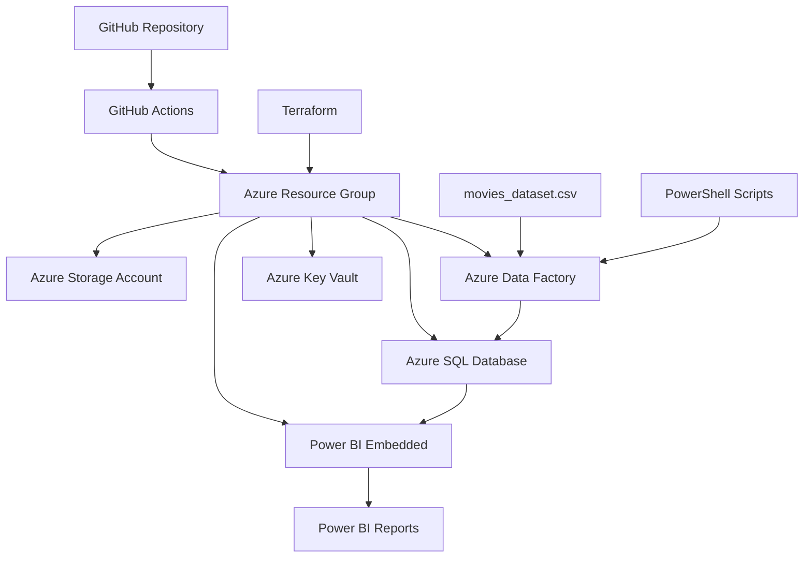

# 🎬 Movies Analytics Platform

## 📋 Descripción del Proyecto

Plataforma completa de análisis de datos de películas que incluye infraestructura en la nube, pipelines de datos automatizados y reportes interactivos en Power BI. Este proyecto utiliza el dataset `movies_dataset.csv` para proporcionar insights sobre la industria cinematográfica.

## Objetivos

- **Análisis Integral**: Proporcionar análisis completo de datos cinematográficos
- **Automatización**: Despliegue y gestión automatizada de infraestructura y datos
- **Visualización**: Reportes interactivos y dashboards en Power BI
- **Escalabilidad**: Infraestructura cloud-native en Azure
- **Calidad**: Pipelines de CI/CD con validaciones automáticas

## Arquitectura del Sistema



## 📊 Estructura de Datos

El dataset `movies_dataset.csv` contiene las siguientes columnas:

| Campo | Tipo | Descripción |
|-------|------|-------------|
| MovieID | Integer | Identificador único de la película |
| Title | String | Título de la película |
| Genre | String | Género cinematográfico |
| ReleaseYear | Integer | Año de lanzamiento |
| Country | String | País de origen |
| BudgetUSD | Decimal | Presupuesto en dólares |
| Global_BoxOfficeUSD | Decimal | Recaudación mundial |
| IMDbRating | Decimal | Calificación en IMDb |
| Director | String | Director de la película |
| Runtime | Integer | Duración en minutos |
| Language | String | Idioma principal |
| ProductionCompany | String | Compañía productora |
| Cast | String | Reparto principal |
| Awards | String | Premios recibidos |
| Plot | String | Sinopsis |
| Poster | String | URL del póster |
| Trailer | String | URL del tráiler |

## Guía de Instalación y Uso

### Prerrequisitos

- **Azure Subscription** con permisos de administrador
- **GitHub Account** con acceso a GitHub Actions
- **Power BI Pro License** o superior
- **Terraform** v1.0+ instalado localmente
- **Azure CLI** instalado y configurado
- **Git** instalado

### 1. Clonar el Repositorio

```bash
git clone https://github.com/AngelVargasGutierrez/Examen_UNIDADI_VARGAS.git
cd examen_UNIDADI_VARGAS
```

### 2. 🔧 Configuración de Secretos en GitHub

Navega a **Settings > Secrets and variables > Actions** en tu repositorio de GitHub y agrega los siguientes secretos:

#### Secretos de Azure
```
AZURE_CLIENT_ID=
AZURE_CLIENT_SECRET=
AZURE_SUBSCRIPTION_ID=
AZURE_TENANT_ID=
```

#### Secretos de SQL Server
```
SQL_ADMIN_USERNAME=
SQL_ADMIN_PASSWORD=
```

#### Secretos de Power BI
```
POWERBI_TENANT_ID=
POWERBI_CLIENT_ID=
POWERBI_CLIENT_SECRET=
POWERBI_WORKSPACE_ID=
```

#### Secretos de Notificaciones
```
TEAMS_WEBHOOK_URL=
```

### 3.  Desplegar Infraestructura

#### Opción A: Despliegue Automático (Recomendado)

1. **Push al repositorio** para activar el workflow automáticamente:
```bash
git add .
git commit -m "Initial deployment"
git push origin main
```

2. **Monitorear el progreso** en la pestaña **Actions** de GitHub

#### Opción B: Despliegue Manual

1. **Inicializar Terraform**:
```bash
terraform init
```

2. **Planificar el despliegue**:
```bash
terraform plan -var="sql_admin_username=<username>" -var="sql_admin_password=<password>"
```

3. **Aplicar la infraestructura**:
```bash
terraform apply -auto-approve
```

### 4. Cargar Datos

Los datos se cargan automáticamente mediante GitHub Actions. Para cargar manualmente:

1. **Ejecutar el workflow** `data-pipeline.yml` desde GitHub Actions
2. **O usar Azure Data Factory** directamente desde el portal de Azure

### 5. Acceder a los Reportes de Power BI

Una vez completado el despliegue, los reportes estarán disponibles en:

#### Reporte 1: Análisis de Películas por Año
- **Descripción**: Análisis detallado de producción cinematográfica por año
- **Características**:
  - Filtro por año (parámetro principal)
  - Métricas de producción y calidad
  - Distribución por género y país
  - Top películas por calificación
  - Análisis de tendencias temporales

#### Reporte 2: Análisis Financiero
- **Descripción**: Análisis de rendimiento financiero de la industria
- **Características**:
  - ROI y rentabilidad por género
  - Análisis presupuesto vs. recaudación
  - Distribución de presupuestos
  - Performance por país
  - Métricas de éxito comercial

#### Reporte 3: Rendimiento de Directores
- **Descripción**: Análisis del desempeño de directores
- **Características**:
  - Rankings por calificación promedio
  - Análisis de especialización por género
  - Métricas de éxito comercial
  - Distribución geográfica
  - Detalles de filmografía

## Workflows Automatizados

### 1. Deploy Infrastructure (`deploy-infrastructure.yml`)
- **Trigger**: Push a main/develop, PR, manual
- **Funciones**:
  - Validación de Terraform
  - Planificación de infraestructura
  - Despliegue automático
  - Notificaciones de estado

### 2. Data Pipeline (`data-pipeline.yml`)
- **Trigger**: Cambios en CSV, manual
- **Funciones**:
  - Validación de datos
  - Creación de esquema de BD
  - Carga de datos
  - Verificación de calidad

### 3. Generate Diagrams (`generate-diagrams.yml`)
- **Trigger**: Cambios en infraestructura
- **Funciones**:
  - Generación de diagramas de arquitectura
  - Creación de diagrama ER
  - Actualización de documentación
  - Generación de diccionario de datos

### 4. Deploy Power BI (`deploy-powerbi.yml`)
- **Trigger**: Cambios en reportes, manual
- **Funciones**:
  - Validación de reportes
  - Despliegue a Power BI Service
  - Configuración de permisos
  - Generación de URLs públicas

## Estructura del Proyecto

```
examen_unidad_VARGAS/
├── movies_dataset.csv          # Dataset principal
├── main.tf                    # Infraestructura principal
├── variables.tf               # Variables de Terraform
├── outputs.tf                 # Outputs de Terraform
├── README.md                  # Este archivo
├── BD.md                      # Documentación de BD
├── .github/workflows/            # Automatizaciones
│   ├── deploy-infrastructure.yml
│   ├── data-pipeline.yml
│   ├── generate-diagrams.yml
│   └── deploy-powerbi.yml
├── powerbi/                      # Reportes de Power BI
│   ├── Report1_Movies_by_Year.json
│   ├── Report2_Financial_Analysis.json
│   └── Report3_Director_Performance.json
├── scripts/                      # Scripts de utilidad
└── docs/                        # Documentación adicional
```

## Monitoreo y Mantenimiento

### Logs y Monitoreo
- **GitHub Actions**: Logs detallados en la pestaña Actions
- **Azure Monitor**: Métricas de infraestructura
- **Power BI**: Métricas de uso de reportes

### Actualizaciones de Datos
- **Automático**: Los workflows se ejecutan en cada push
- **Manual**: Ejecutar workflows desde GitHub Actions
- **Programado**: Configurar cron jobs en los workflows

### Backup y Recuperación
- **Base de Datos**: Backup automático configurado en Azure SQL
- **Código**: Versionado en GitHub
- **Reportes**: Exportación automática de Power BI

## Solución de Problemas

### Errores Comunes

#### 1. Error de Autenticación en Azure
```bash
# Verificar login
az login
az account show

# Configurar subscription
az account set --subscription <subscription-id>
```

#### 2. Error en Terraform
```bash
# Limpiar estado
terraform refresh

# Reinicializar
terraform init -upgrade
```

#### 3. Error en Power BI
- Verificar permisos del Service Principal
- Confirmar que el workspace existe
- Validar las credenciales en GitHub Secrets

### Logs Útiles
- **Terraform**: `terraform.log`
- **GitHub Actions**: Pestaña Actions en GitHub
- **Azure**: Portal de Azure > Monitor > Logs

## Soporte

Para reportar problemas o solicitar nuevas características:

1. **Issues**: Crear un issue en GitHub
2. **Documentación**: Consultar la wiki del proyecto
3. **Logs**: Revisar los logs de GitHub Actions

## Enlaces Importantes

- **Repositorio**: [GitHub Repository URL]
- **Azure Portal**: [Portal de Azure](https://portal.azure.com)
- **Power BI Service**: [Power BI](https://app.powerbi.com)
- **Documentación de BD**: [BD.md](./BD.md)

## Notas de Versión

### v1.0.0 - Lanzamiento Inicial
- Infraestructura completa en Azure
- Pipeline de datos automatizado
- 3 reportes interactivos en Power BI
- Documentación completa
-  Workflows de CI/CD

---

